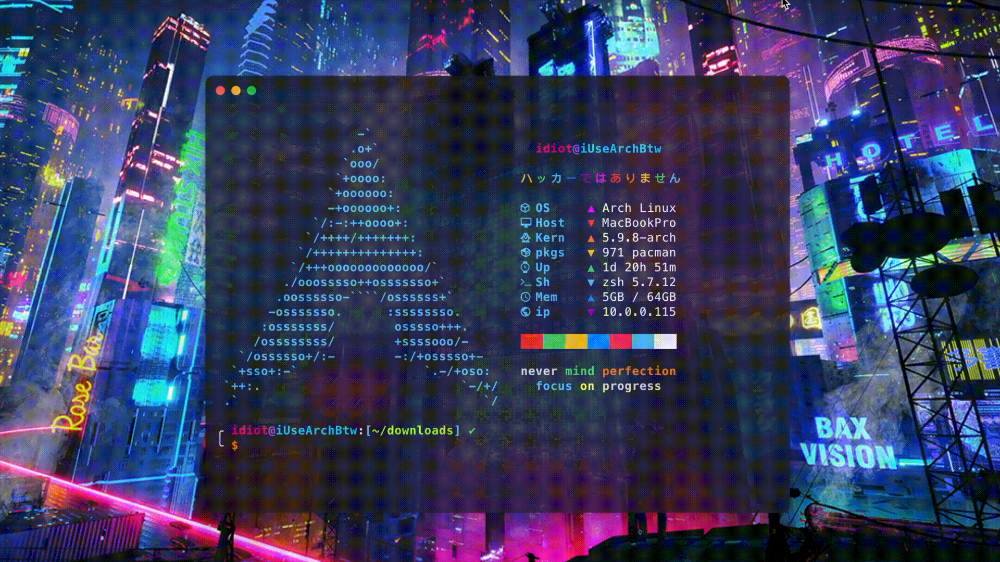
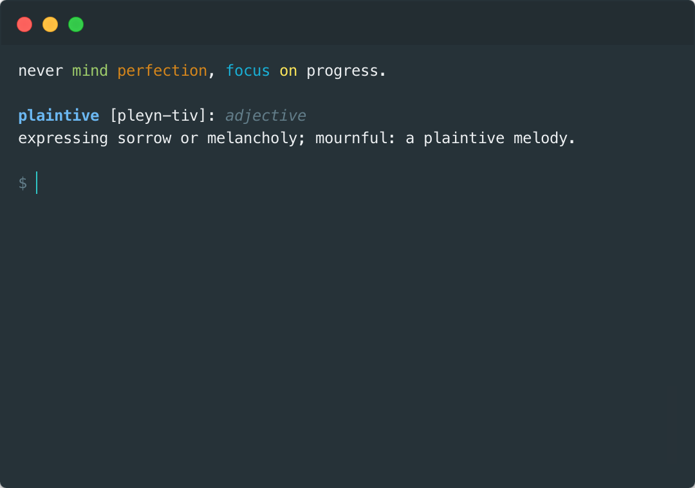

<div align="center">

  <h1>Vocab</h1>

  A short Python script that displays a new vocabulary word in your terminal, built with the power of webscraping using Requests and Beautiful Soup. Each day a new word is shown in your terminal!

  [](https://github.com/itstommi/Vocab/issues)
  [](https://github.com/itstommi/Vocab/network)
  [](https://github.com/itstommi/Vocab/stargazers)

</div>

<br>

## Previews



## Requirements
Run the following command to install dependencies:
<br><br>
$ ```pip install requests bs4```
<br>

## Files
```config/.hyper.js``` - My Hyper config file
<br>
```config/.bash_profile``` - My bash configuration
<br>
```vocab.py``` - The python file to scrape dictionary.com for the word of the day

## Important Notes
- The terminal I use is called [Hyper](https://hyper.is)
- The new macOS Catalina uses Zsh instead of Bash, but I switched back to Bash using Hyper (in the config file, it is on line **108**). Please change this accordingly as there are instructions in the file
- On macOS Catalina, switching back to Bash gives an ugly message everytime a new terminal window opens, so I configured `.bash_profile` to remove the message. If you never got the message in the first place, you can remove lines **1-3** on the `.bash_profile`
- The code in `.bash_profile` is commented. Please look thru and make changes if needed (change the path on the 'vocab' command in the `.bash_profile` according to where you clone/download)
- On lines **155-157** of the `.hyper.js` file, those are the plugins I prefer.
- On lines **158-161** of the `.hyper.js` file, I left cool plugins for you guys to check out